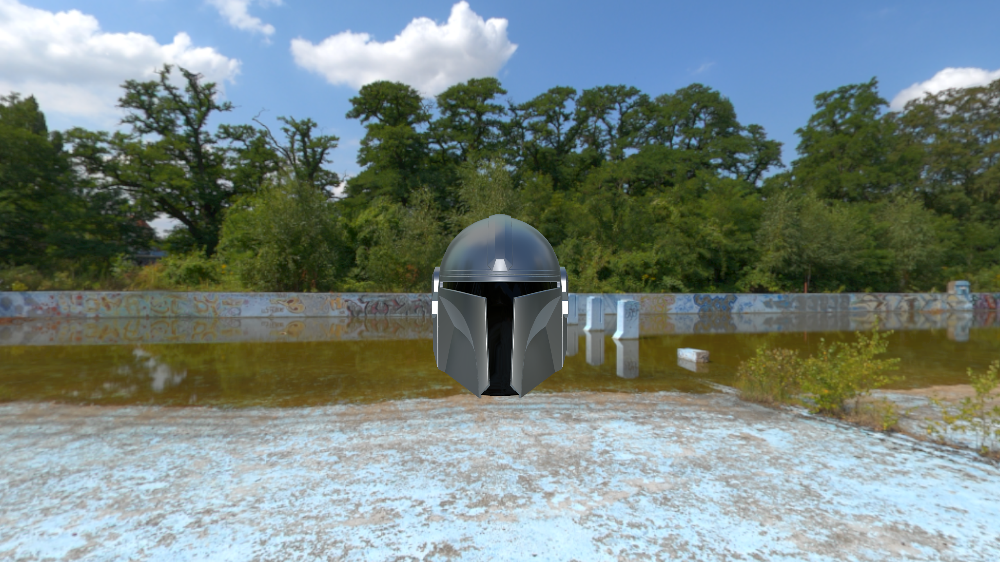

# OpenGL Renderer Rust

This is something like my third attempt at an opengl renderer, and I think that this is one of my better ones. 
I think the structure of the program will be much easier to use and more performant, but I haven't done anything more than load a few models in. 
So I don't know how easy it will be to use in a project.

I am currently following the tutorial from [Learn OpenGL](https://learnopengl.com) which has been quite interesting. 
I'd recommend checking it out if you are interested in OpenGL!

# Table of contents

1. [Current Features](#current-features)
1. [Screenshots](#screenshots)
1. [Architecture](#current-architecture)

# Current Features
Below is what I have done so far:

* Early implementation of Physically Based Rendering (PBR)
    * PBR Reflections
* Skybox
* Phong rendering

# Screenshots

# Current architecture

1. When you load a model you pass in a material that will be used to render the model.
    * The material is in charge of most of the uniforms (ex. textures) that will be used in the rendering process.
1. Each frame you create a render scene which will hold information about the whole scene (ex. lighting, camera position, etc.)
    * You'll also pass in what should be rendered that frame. The scene will then hold a reference to object's vertex buffer, index buffer, and material.
1. When finish() is called on the scene, it will tell each object to be rendered using the material assigned at the object's creation.
1. Each material has a render function which will decide how the object should be rendered and then renders the item.
